# 🌐 Caddy Cloudflare DNS Updater

Automatically synchronize domains from your Caddy web server configuration with Cloudflare DNS records. This powerful yet lightweight tool monitors your Caddyfile and ensures your DNS A/AAAA records always point to your server's current public IP address - perfect for dynamic IP environments and self-hosted services.

[](https://hub.docker.com/r/mbradley672/caddy-cloudflare-updater)
[](https://hub.docker.com/r/mbradley672/caddy-cloudflare-updater)
[](https://github.com/mbradley672/caddy-cloudflare-updater/actions)
[](https://opensource.org/licenses/MIT)
[](https://github.com/mbradley672/caddy-cloudflare-updater/issues)
[](https://github.com/mbradley672/caddy-cloudflare-updater/stargazers)

## 🚀 Quick Start

### Docker Hub (Recommended)

Pull and run the latest image from Docker Hub:

```bash
# Pull the latest image
docker pull mbradley672/caddy-cloudflare-updater:latest

# Quick start with file watcher mode
docker run -d \
  --name caddy-dns-updater \
  --restart unless-stopped \
  -e CF_API_TOKEN=your_cloudflare_api_token \
  -e CF_ZONE_ID=your_cloudflare_zone_id \
  -e CF_DOMAIN=yourdomain.com \
  -e RUN_MODE=watcher \
  -v /etc/caddy/Caddyfile:/etc/caddy/Caddyfile:ro \
  mbradley672/caddy-cloudflare-updater:latest
```

> 📖 **For detailed Docker Hub usage instructions, see [DOCKER_HUB_README.md](DOCKER_HUB_README.md)**

## ✨ Key Features

- **🔄 Automatic DNS Sync**: Reads domains from Caddyfile and creates/updates Cloudflare DNS records
- **📡 Dynamic IP Detection**: Automatically detects your server's current public IP address (IPv4/IPv6)
- **👁️ Real-time Monitoring**: File watcher mode monitors Caddyfile changes and updates DNS immediately
- **⏰ Scheduled Updates**: Built-in cron mode for periodic synchronization (every 10 minutes)
- **🔧 Flexible Run Modes**: Choose from once, watcher, cron, or hybrid modes
- **📊 Comprehensive Logging**: Detailed logs with configurable verbosity levels
- **🏗️ Multi-Architecture**: Native Docker images for AMD64 and ARM64 platforms
- **🔒 Security-First**: API tokens via environment variables, read-only file mounts
- **🐳 Container-Ready**: Optimized Docker images with proper signal handling

## 🎯 Perfect For

- **🏠 Home Labs**: Keep your self-hosted services accessible with dynamic IPs
- **🏢 Small Businesses**: Automate DNS management for web services  
- **👨‍💻 Developers**: Seamless integration with Caddy reverse proxy setups
- **🌍 Remote Workers**: Maintain access to home services from anywhere
- **☁️ Cloud Deployments**: Dynamic DNS management in container environments

## 📋 Prerequisites

- **Cloudflare Account**: With API access and a domain managed by Cloudflare
- **Cloudflare API Token**: With `Zone:Read` and `DNS:Edit` permissions
- **Caddy Web Server**: With a readable Caddyfile configuration
- **Docker** (recommended) or **Python 3.8+** for local installation

## 🛠️ Installation & Usage

### Method 1: 🐳 Docker Hub (Easiest)

**Basic Usage:**
```bash
docker pull mbradley672/caddy-cloudflare-updater:latest

docker run -d \
  --name caddy-dns-updater \
  --restart unless-stopped \
  -e CF_API_TOKEN=your_cloudflare_api_token \
  -e CF_ZONE_ID=your_cloudflare_zone_id \
  -e CF_DOMAIN=yourdomain.com \
  -e RUN_MODE=watcher \
  -v /etc/caddy/Caddyfile:/etc/caddy/Caddyfile:ro \
  mbradley672/caddy-cloudflare-updater:latest
```

**Platform-Specific Examples:**

<details>
<summary><strong>🐧 Linux/macOS</strong></summary>

```bash
docker run -d \
  --name caddy-dns-updater \
  --restart unless-stopped \
  -e CF_API_TOKEN=your_cloudflare_api_token \
  -e CF_ZONE_ID=your_cloudflare_zone_id \
  -e CF_DOMAIN=yourdomain.com \
  -e RUN_MODE=watcher \
  -e LOG_LEVEL=INFO \
  -v /etc/caddy/Caddyfile:/etc/caddy/Caddyfile:ro \
  -v ./logs:/var/log \
  mbradley672/caddy-cloudflare-updater:latest
```
</details>

<details>
<summary><strong>🪟 Windows PowerShell</strong></summary>

```powershell
docker run -d `
  --name caddy-dns-updater `
  --restart unless-stopped `
  -e CF_API_TOKEN=your_cloudflare_api_token `
  -e CF_ZONE_ID=your_cloudflare_zone_id `
  -e CF_DOMAIN=yourdomain.com `
  -e RUN_MODE=watcher `
  -e LOG_LEVEL=INFO `
  -v C:\caddy\Caddyfile:/etc/caddy/Caddyfile:ro `
  -v ${PWD}\logs:/var/log `
  mbradley672/caddy-cloudflare-updater:latest
```
</details>

<details>
<summary><strong>🪟 Windows Command Prompt</strong></summary>

```cmd
docker run -d ^
  --name caddy-dns-updater ^
  --restart unless-stopped ^
  -e CF_API_TOKEN=your_cloudflare_api_token ^
  -e CF_ZONE_ID=your_cloudflare_zone_id ^
  -e CF_DOMAIN=yourdomain.com ^
  -e RUN_MODE=watcher ^
  -e LOG_LEVEL=INFO ^
  -v C:\caddy\Caddyfile:/etc/caddy/Caddyfile:ro ^
  -v %CD%\logs:/var/log ^
  mbradley672/caddy-cloudflare-updater:latest
```
</details>

### Method 2: 📦 Docker Compose (Recommended)

1. **Clone this repository:**
```bash
git clone https://github.com/mbradley672/caddy-cloudflare-updater.git
cd caddy-cloudflare-updater
```

2. **Create environment file:**
```bash
cp .env.example .env
```

3. **Configure your credentials in `.env`:**
```env
CF_API_TOKEN=your_cloudflare_api_token
CF_ZONE_ID=your_cloudflare_zone_id
CF_DOMAIN=yourdomain.com
CADDYFILE_PATH=/etc/caddy/Caddyfile
RUN_MODE=watcher
LOG_LEVEL=INFO
```

4. **Choose the appropriate compose file:**
   - **Linux/macOS**: `docker-compose.linux.yml` 
   - **Windows**: `docker-compose.windows.yml`
   - **Generic/Hub**: `docker-compose.hub.yml`

5. **Update Caddyfile path in compose file:**
```yaml
volumes:
  # Linux/macOS example:
  - /etc/caddy/Caddyfile:/etc/caddy/Caddyfile:ro
  
  # Windows example:  
  - C:/caddy/Caddyfile:/etc/caddy/Caddyfile:ro
  
  # Same directory:
  - ./Caddyfile.example:/etc/caddy/Caddyfile:ro
```

6. **Deploy:**
```bash
# Linux/macOS
docker-compose -f docker-compose.linux.yml up -d

# Windows  
docker-compose -f docker-compose.windows.yml up -d

# Using Docker Hub image
docker-compose -f docker-compose.hub.yml up -d
```

### Method 3: 🐍 Python Installation

<details>
<summary><strong>Local Python Setup</strong></summary>

1. **Clone and setup:**
```bash
git clone https://github.com/mbradley672/caddy-cloudflare-updater.git
cd caddy-cloudflare-updater

# Create virtual environment
python -m venv venv

# Activate virtual environment
# Linux/macOS:
source venv/bin/activate
# Windows:
venv\Scripts\activate

# Install dependencies
pip install -r requirements.txt
```

2. **Configure environment:**
```bash
# Linux/macOS
export CF_API_TOKEN=your_cloudflare_api_token
export CF_ZONE_ID=your_cloudflare_zone_id
export CF_DOMAIN=yourdomain.com
export CADDYFILE_PATH=/etc/caddy/Caddyfile

# Windows PowerShell
$env:CF_API_TOKEN="your_cloudflare_api_token"
$env:CF_ZONE_ID="your_cloudflare_zone_id"
$env:CF_DOMAIN="yourdomain.com"
$env:CADDYFILE_PATH="C:\caddy\Caddyfile"
```

3. **Run the application:**
```bash
# One-time sync
python main.py

# File watcher mode
python watcher.py
```
</details>

## ⚙️ Configuration

### 🔑 Environment Variables

| Variable | Description | Required | Default |
|----------|-------------|----------|---------|
| `CF_API_TOKEN` | Cloudflare API token with DNS edit permissions | ✅ Yes | - |
| `CF_ZONE_ID` | Cloudflare Zone ID for your domain | ✅ Yes | - |
| `CF_DOMAIN` | Your root domain (e.g., example.com) | ✅ Yes | - |
| `CADDYFILE_PATH` | Path to your Caddyfile | ❌ No | `/etc/caddy/Caddyfile` |
| `RUN_MODE` | Execution mode: `once`, `watcher`, `cron`, `hybrid` | ❌ No | `once` |
| `LOG_LEVEL` | Logging level: `DEBUG`, `INFO`, `WARNING`, `ERROR` | ❌ No | `INFO` |

### 🔐 Getting Cloudflare Credentials

<details>
<summary><strong>Step-by-Step Cloudflare Setup</strong></summary>

1. **Create API Token**:
   - Go to [Cloudflare API Tokens](https://dash.cloudflare.com/profile/api-tokens)
   - Click "Create Token"
   - Choose "Custom token"
   - Configure permissions:
     - **Zone Resources**: Include → Specific zone → `yourdomain.com`
     - **Zone Permissions**: `Zone:Read`
     - **Zone Permissions**: `DNS:Edit`
   - Click "Continue to summary" → "Create Token"
   - **Copy the token** (you won't see it again!)

2. **Find Zone ID**:
   - Go to your domain's overview in Cloudflare dashboard
   - Scroll down to the right sidebar
   - Copy the **Zone ID** value

3. **Test Your Setup**:
   ```bash
   # Test API token (replace with your values)
   curl -X GET "https://api.cloudflare.com/client/v4/zones/YOUR_ZONE_ID" \
        -H "Authorization: Bearer YOUR_API_TOKEN" \
        -H "Content-Type: application/json"
   ```
</details>

### 🏃‍♂️ Run Modes

| Mode | Description | Use Case |
|------|-------------|----------|
| `once` | Single execution, then exit | Manual updates, testing |
| `watcher` | Monitor Caddyfile for changes | Real-time DNS updates |
| `cron` | Periodic updates (every 10 minutes) | Scheduled maintenance |
| `hybrid` | Both watcher + cron combined | Maximum reliability |

## 🚦 Usage Examples

### Single DNS Sync
```bash
docker run --rm \
  -e CF_API_TOKEN=your_token \
  -e CF_ZONE_ID=your_zone_id \
  -e CF_DOMAIN=yourdomain.com \
  -e RUN_MODE=once \
  -v /etc/caddy/Caddyfile:/etc/caddy/Caddyfile:ro \
  mbradley672/caddy-cloudflare-updater:latest
```

### Real-time File Monitoring
```bash
docker run -d \
  --name caddy-dns-watcher \
  --restart unless-stopped \
  -e CF_API_TOKEN=your_token \
  -e CF_ZONE_ID=your_zone_id \
  -e CF_DOMAIN=yourdomain.com \
  -e RUN_MODE=watcher \
  -e LOG_LEVEL=DEBUG \
  -v /etc/caddy/Caddyfile:/etc/caddy/Caddyfile:ro \
  -v ./logs:/var/log \
  mbradley672/caddy-cloudflare-updater:latest
```

### Hybrid Mode (Recommended)
```bash
docker run -d \
  --name caddy-dns-hybrid \
  --restart unless-stopped \
  -e CF_API_TOKEN=your_token \
  -e CF_ZONE_ID=your_zone_id \
  -e CF_DOMAIN=yourdomain.com \
  -e RUN_MODE=hybrid \
  -v /etc/caddy/Caddyfile:/etc/caddy/Caddyfile:ro \
  mbradley672/caddy-cloudflare-updater:latest
```

## 🔍 How It Works

```mermaid
graph TD
    A[Caddyfile] -->|Parse| B[Extract Domains]
    B --> C[Get Public IP]
    C --> D[Query Cloudflare DNS]
    D --> E{Records Exist?}
    E -->|No| F[Create DNS Records]
    E -->|Yes| G{IP Changed?}
    G -->|Yes| H[Update DNS Records]
    G -->|No| I[No Action Needed]
    F --> J[✅ DNS Updated]
    H --> J
    I --> K[✅ DNS Current]
```



### Process Flow:
1. **🔍 Domain Extraction**: Parses your Caddyfile to extract all configured domains and subdomains
2. **🌐 IP Detection**: Fetches your server's current public IP address (supports both IPv4 and IPv6)
3. **📊 DNS Comparison**: Queries existing Cloudflare DNS records for your domains
4. **🔄 Smart Updates**: Only creates/updates records when changes are detected
5. **📝 Detailed Logging**: Provides comprehensive logs of all operations

### 📁 Supported Caddyfile Formats

The tool automatically detects and handles various Caddyfile configurations:

```caddy
# Simple domain
example.com {
    reverse_proxy localhost:8080
}

# Multiple domains
app.example.com, api.example.com {
    reverse_proxy localhost:3000
}

# Wildcard subdomains (creates record for wildcard)
*.example.com {
    reverse_proxy localhost:8080
}

# Complex configurations with multiple blocks
blog.example.com {
    root * /var/www/blog
    file_server
}

shop.example.com {
    reverse_proxy localhost:8090
    header {
        X-Frame-Options DENY
    }
}
```

## 📂 Project Structure

```
caddy-cloudflare-updater/
├── 📄 main.py                    # Core DNS synchronization logic
├── 👀 watcher.py                 # File watcher for real-time updates  
├── 🐳 Dockerfile                 # Multi-stage Docker build
├── 🚀 entrypoint.sh              # Container startup script
├── 📦 requirements.txt           # Python dependencies
├── 🔧 docker-compose.*.yml       # Platform-specific Docker Compose files
├── 🌍 .env.example               # Environment variables template
├── ⏰ crontab.txt                # Example cron configuration
├── 📖 Caddyfile.example          # Sample Caddyfile for testing
├── 🔄 .github/workflows/         # CI/CD automation
│   └── docker-build.yml         # Multi-arch Docker builds
├── 📋 README.md                  # This comprehensive guide
├── 🐳 DOCKER_HUB_README.md       # Docker Hub specific documentation
└── 📜 LICENSE                    # MIT License
```

## 🔧 Advanced Configuration

### 🎛️ Docker Volume Mounts

For persistent logs and configuration:

```bash
docker run -d \
  --name caddy-dns-updater \
  --restart unless-stopped \
  -e CF_API_TOKEN=your_token \
  -e CF_ZONE_ID=your_zone_id \
  -e CF_DOMAIN=yourdomain.com \
  -e RUN_MODE=hybrid \
  -e LOG_LEVEL=INFO \
  -v /etc/caddy/Caddyfile:/etc/caddy/Caddyfile:ro \
  -v caddy-dns-logs:/var/log \
  -v caddy-dns-config:/app/config \
  mbradley672/caddy-cloudflare-updater:latest
```

### 🌐 Network Configuration

For advanced Docker networking:

```bash
# Create custom network
docker network create caddy-network

# Run with custom network
docker run -d \
  --name caddy-dns-updater \
  --network caddy-network \
  --restart unless-stopped \
  # ... environment variables ...
  mbradley672/caddy-cloudflare-updater:latest
```

### 📊 Health Checks

Add health checks to your Docker setup:

```yaml
# docker-compose.yml example
services:
  caddy-dns-updater:
    image: mbradley672/caddy-cloudflare-updater:latest
    environment:
      - CF_API_TOKEN=${CF_API_TOKEN}
      - CF_ZONE_ID=${CF_ZONE_ID}
      - CF_DOMAIN=${CF_DOMAIN}
      - RUN_MODE=hybrid
    volumes:
      - /etc/caddy/Caddyfile:/etc/caddy/Caddyfile:ro
      - ./logs:/var/log
    healthcheck:
      test: ["CMD", "python", "-c", "import requests; requests.get('https://api.cloudflare.com/client/v4/user/tokens/verify', headers={'Authorization': 'Bearer ' + open('/tmp/token').read()})"]
      interval: 30s
      timeout: 10s
      retries: 3
      start_period: 30s
    restart: unless-stopped
```

## 🐛 Troubleshooting

### Common Issues & Solutions

<details>
<summary><strong>🚫 Authentication Errors</strong></summary>

**Problem**: `401 Unauthorized` or `403 Forbidden` errors

**Solutions**:
1. **Verify API Token**:
   ```bash
   curl -X GET "https://api.cloudflare.com/client/v4/user/tokens/verify" \
        -H "Authorization: Bearer YOUR_API_TOKEN"
   ```

2. **Check Token Permissions**:
   - Ensure `Zone:Read` and `DNS:Edit` permissions
   - Verify token includes your specific zone

3. **Regenerate Token**: Create a new API token if needed
</details>

<details>
<summary><strong>📁 File Access Issues</strong></summary>

**Problem**: `FileNotFoundError` or `Permission denied`

**Solutions**:
1. **Check File Path**:
   ```bash
   # Verify Caddyfile exists and is readable
   ls -la /etc/caddy/Caddyfile
   ```

2. **Fix Volume Mount** (Docker):
   ```bash
   # Correct format
   -v /host/path/to/Caddyfile:/etc/caddy/Caddyfile:ro
   ```

3. **Set Proper Permissions**:
   ```bash
   # Make Caddyfile readable
   chmod 644 /etc/caddy/Caddyfile
   ```
</details>

<details>
<summary><strong>🌐 Network Connectivity</strong></summary>

**Problem**: Cannot reach Cloudflare API

**Solutions**:
1. **Test Connectivity**:
   ```bash
   curl -I https://api.cloudflare.com/client/v4/
   ```

2. **Check DNS Resolution**:
   ```bash
   nslookup api.cloudflare.com
   ```

3. **Firewall Rules**: Ensure outbound HTTPS (443) is allowed
</details>

<details>
<summary><strong>🔄 Container Restart Loops</strong></summary>

**Problem**: Container keeps restarting

**Solutions**:
1. **Check Logs**:
   ```bash
   docker logs caddy-dns-updater --tail 50
   ```

2. **Validate Environment Variables**:
   ```bash
   docker exec caddy-dns-updater env | grep CF_
   ```

3. **Test Configuration**:
   ```bash
   # Run in debug mode
   docker run --rm \
     -e CF_API_TOKEN=your_token \
     -e CF_ZONE_ID=your_zone_id \
     -e CF_DOMAIN=yourdomain.com \
     -e RUN_MODE=once \
     -e LOG_LEVEL=DEBUG \
     -v /etc/caddy/Caddyfile:/etc/caddy/Caddyfile:ro \
     mbradley672/caddy-cloudflare-updater:latest
   ```
</details>

### 🔍 Debug Mode

Enable detailed logging for troubleshooting:

```bash
# Environment variable
export LOG_LEVEL=DEBUG

# Docker run
docker run -e LOG_LEVEL=DEBUG ...

# Check logs
docker logs caddy-dns-updater --follow
```

### 📞 Getting Help

1. **Check existing issues**: [GitHub Issues](https://github.com/mbradley672/caddy-cloudflare-updater/issues)
2. **Create detailed bug report** with:
   - Environment details (OS, Docker version)
   - Configuration (sanitized, remove secrets)
   - Complete error logs
   - Steps to reproduce

## 🔒 Security Best Practices

### 🔐 API Token Security

- **Never commit tokens** to version control
- **Use environment variables** or secure secret management
- **Regularly rotate tokens** (every 90 days recommended)
- **Limit token scope** to specific zones only
- **Monitor token usage** in Cloudflare dashboard

### 🐳 Container Security

```bash
# Run as non-root user
docker run --user 1000:1000 ...

# Read-only file system where possible
docker run --read-only --tmpfs /tmp ...

# Limit resources
docker run --memory=128m --cpus=0.5 ...

# Drop unnecessary capabilities
docker run --cap-drop=ALL --cap-add=NET_BIND_SERVICE ...
```

### 📁 File Permissions

```bash
# Restrict Caddyfile access
chmod 640 /etc/caddy/Caddyfile
chown caddy:caddy /etc/caddy/Caddyfile

# Secure log directory
chmod 750 /var/log/caddy-dns-updater
```
## 🤝 Contributing

We welcome contributions! Here's how you can help improve this project:

### 🐛 Bug Reports

1. **Search existing issues** first
2. **Use the issue template** when creating new issues
3. **Include detailed information**:
   - Environment details (OS, Docker version, Python version)
   - Configuration (sanitized, no secrets)
   - Complete error logs
   - Steps to reproduce

### ✨ Feature Requests

1. **Check existing feature requests** in issues
2. **Describe the use case** and benefits
3. **Provide implementation suggestions** if possible

### 🔧 Development Setup

1. **Fork and clone**:
```bash
git clone https://github.com/yourusername/caddy-cloudflare-updater.git
cd caddy-cloudflare-updater
```

2. **Create development environment**:
```bash
python -m venv venv
source venv/bin/activate  # or venv\Scripts\activate on Windows
pip install -r requirements.txt
```

3. **Create feature branch**:
```bash
git checkout -b feature/amazing-new-feature
```

4. **Make changes and test**:
```bash
# Test locally
python main.py

# Test with Docker
docker build -t test-image .
docker run --rm -e CF_API_TOKEN=test ... test-image
```

5. **Submit pull request**:
   - Write clear commit messages
   - Include tests if applicable
   - Update documentation
   - Follow existing code style

### 📋 Development Guidelines

- **Code Style**: Follow PEP 8 for Python code
- **Documentation**: Update README.md for new features
- **Testing**: Test on multiple platforms when possible
- **Commits**: Use conventional commit messages
- **Security**: Never commit secrets or tokens

## 📈 Roadmap

### 🎯 Upcoming Features

- [ ] **Multiple Zone Support**: Handle multiple Cloudflare zones
- [ ] **DNS Record Types**: Support for CNAME, MX, TXT records
- [ ] **Health Monitoring**: Built-in health check endpoints
- [ ] **Web Dashboard**: Simple web interface for monitoring
- [ ] **Notification System**: Slack/Discord/email notifications
- [ ] **Configuration Validation**: Pre-flight checks for settings
- [ ] **Metrics Export**: Prometheus metrics support
- [ ] **Backup/Restore**: DNS record backup and restoration

### 🔮 Long-term Vision

- **Plugin System**: Extensible architecture for custom providers
- **Multi-Provider Support**: Support for other DNS providers (Route53, Namecheap, etc.)
- **Advanced Parsing**: Support for more complex Caddyfile configurations
- **High Availability**: Clustering and failover support

## 📜 License

This project is licensed under the **MIT License** - see the [LICENSE](LICENSE) file for details.

### What this means:
- ✅ **Commercial use** allowed
- ✅ **Modification** allowed  
- ✅ **Distribution** allowed
- ✅ **Private use** allowed
- ❌ **No warranty** provided
- ❌ **No liability** assumed

## 🌟 Support This Project

If this project helps you, consider:

- ⭐ **Starring** this repository
- 🐛 **Reporting bugs** and **suggesting features**
- 🤝 **Contributing** code improvements
- 📢 **Sharing** with others who might benefit
- 💬 **Providing feedback** on your use cases

## 📊 Project Stats


## 📚 Additional Resources

- 📖 **[Docker Hub Documentation](DOCKER_HUB_README.md)** - Detailed Docker usage
- 🔧 **[Caddy Documentation](https://caddyserver.com/docs/)** - Learn about Caddy web server
- ☁️ **[Cloudflare API Docs](https://developers.cloudflare.com/api/)** - Cloudflare API reference
- 🐳 **[Docker Best Practices](https://docs.docker.com/develop/dev-best-practices/)** - Container optimization
- 🔒 **[Security Guidelines](https://owasp.org/www-project-container-security/)** - Container security practices

---

<div align="center">

**Made with ❤️ for the Caddy and self-hosting community**

[🏠 Home](https://github.com/mbradley672/caddy-cloudflare-updater) • 
[📖 Docs](DOCKER_HUB_README.md) • 
[🐛 Issues](https://github.com/mbradley672/caddy-cloudflare-updater/issues) • 
[💬 Discussions](https://github.com/mbradley672/caddy-cloudflare-updater/discussions) • 
[🐳 Docker Hub](https://hub.docker.com/r/mbradley672/caddy-cloudflare-updater)

</div>
